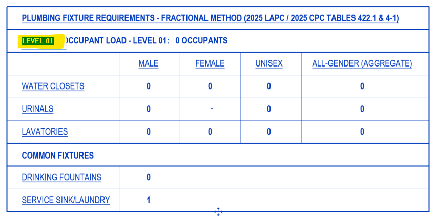
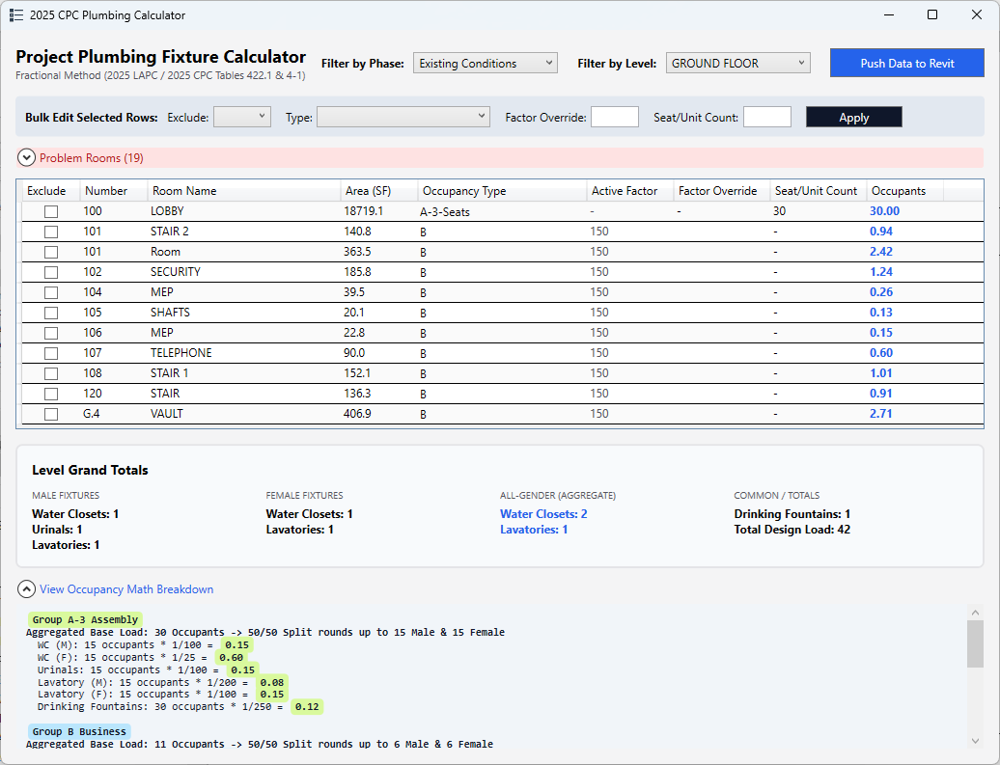

# pyRevit Plumbing Code Fixture Calculator

An interactive, modeless pyRevit extension designed to automate plumbing fixture calculations directly within Revit. This tool complies with the fractional method outlined in the **2025 Los Angeles Plumbing Code (LAPC)** and **2025 California Plumbing Code (CPC)** (Tables 422.1 & 4-1). 

It aggregates occupant loads by occupancy group per floor, tracks exact decimal fractions, dynamically generates a live math breakdown, handles all-gender aggregate restroom requirements, and pushes final integer counts to a custom parameterized annotation table for your code sheets.

---

## Features

* **2025 Code Compliant Engine**: Implements the latest thresholds, sex splits, step-functions, and divisors for all 21+ classifications in Table 422.1.
* **All-Gender Restroom Support**: Calculates the minimum aggregate counts by summing male and female fractions prior to a single final round-up, per 2025 CPC Section 422.1.1.
* **Level & Phase Filtering**: Isolates calculations to a selected floor and chronological phase, eliminating double-counting of rooms from older or demolished phases.
* **Bulk Parameter Editing**: Select multiple rooms in the dashboard UI to change their occupancy types, factor overrides, or exclusion status simultaneously.
* **Dynamic Width DataGrid**: Instant responsive UI rendering with rounded "pill" highlights for math metrics and automatic column sorting.
* **Live UI Sync & Safe Input Parsing**: Automatically updates mathematical outputs as you type by deferring calculations until cell modifications are committed.
* **Collapsible Math Breakdowns**: Displays real-time, bolded addition strings showing exactly how individual room values roll up to group totals.

---

## Installation & Setup Workflow

Please complete the following steps to get the plugin installed and configured.

1. [Step 1: Install via pyRevit Extension Manager](#step-1-install-via-pyrevit-extension-manager)
2. [Step 2: First Run & Automated Parameter Binding](#step-2-first-run--automated-parameter-binding)
3. [Step 3: Build the Schedule Sheet Annotation Table](#step-3-build-the-schedule-sheet-annotation-table)
4. [Keeping the Tool Updated](#keeping-the-tool-updated)

---

### Step 1: Install via pyRevit Extension Manager

You can install this extension directly from this GitHub repository using pyRevit's built-in tools.

1. Open Revit and navigate to the `pyRevit` tab on the ribbon.
2. Click the `pyRevit` drop-down menu (small triangle icon next to "pyRevit") and select `Extensions`.
3. In the Extension Manager window, paste this repository's Git URL into the GIT URL field:
   `https://github.com/burnished-edge/pyRevit-Plumbing-Calculator.git`
4. Provide a name for the tool if prompted, then click `Add and install`. 
5. Once the installation completes, close the Extension Manager and click `Reload` in the pyRevit ribbon menu. The new ribbon button panel will generate on your screen.

---

### Step 2: First Run & Automated Parameter Binding

There is no need to manually set up or link a Shared Parameters text file. The tool includes an integrated setup mechanism that injects and configures its own database schema upon initialization.

1. Click your newly loaded `Plumbing Calc` button on the Revit ribbon.
2. The script will quietly scan your active project database. 
3. Finding the required fields unlinked, it will automatically inject the necessary shared parameters directly into your project and bind them to the native `Rooms` category.
4. Upon successful generation, a dialogue pop-up window will notify you that the parameter injection and binding succeeded. 
5. Close the pop-up, and your calculator dashboard will open. On all future clicks, the tool will bypass this setup sequence seamlessly.

> **Fallback Note**: If corporate model permissions cause the automated binding routine to fail, please follow the manual override configuration steps detailed in the [Manual Parameter Binding Appendix](#manual-parameter-binding-appendix).

---

### Step 3: Build the Schedule Sheet Annotation Table

> ⚠️ **SYSTEM REQUIREMENT**: The accompanying grand total schedule annotation family requires **Autodesk Revit 2026 or newer** due to fundamental database architecture shifts within modern API data schemas.

To display the project grand totals dynamically on your code documentation sheets, you must leverage a single parameterized block family.

1. Download the prebuilt family from this repo. Open your project model, navigate to `Insert > Load Family` and point it to the family you just downloaded.
2. Place an instance of this `Plumb_GrandTotals_Table` annotation family directly onto your targeted code sheet or drafting view.
3. Select the family instance, look at the Properties Palette, and locate the `GT_Level_Target` text field.
4. Type the exact case-sensitive name of the level you wish to report (e.g., `Level 1`). 

The calculator is now completely installed and configured!

---

## Keeping the Tool Updated

Because the extension is linked directly to GitHub via pyRevit, applying future updates is effortless. Whenever a new version or bug fix is pushed to this repository:

1. Open the `pyRevit Extension Manager`.
2. Locate the Plumbing Calculator in your installed list.
3. Click `Update`. pyRevit will automatically pull the latest source code from GitHub and apply the changes. 
4. Reload pyRevit to see the updates take effect.

---

## How To Use

1. Click the `Plumbing Calc` button on your ribbon panel to launch the modeless dashboard.
2. Use the top filters to isolate your target `Phase` and `Level`. The tool automatically identifies the newest chronological phase by default.
3. For each room line-item, assign its `Occupancy Type` using the alphabetized selector drop-down. The script instantly snaps to default load factors or provides a symbol indicator (`-`) if seat-count overrides apply.
4. If needed, select multiple rooms simultaneously and utilize the `Bulk Editor` pane to change types or check `Exclude Room` recursively.
5. Expand the `View Math Breakdown` panel at the base to evaluate the raw aggregated code math formatting.
6. Click `Calculate & Push Data to Revit`. This automatically writes parameter values to individual rooms, targets your schedule block instance via `GT_Level_Target`, and updates the sheet schedule integers instantly.

> Note if the table isn't placed or if the Level name isn't filled out or doesn't match any level names, you will see an error message. This can be safely ignored if you don't need the table.

---

## Manual Parameter Binding Appendix

Use these instructions only if the automated parameter registration loop fails:
1. Go to the `Manage` tab on the ribbon and click `Project Parameters`.
2. Click `Add`, select `Shared Parameter`, and click `Select`.
3. Choose the `PlumbingCalc` group, pick your first parameter, and configure it as an `Instance` parameter.
4. Set `Group parameter under` to *Data* or *Plumbing*.
5. Check `Values can vary by group instance`.
6. In the right-hand Categories list, check `Rooms` and click `OK`.
7. Repeat this exact sequence for all parameters in the file.

[Back to Setup Workflow](#installation--setup-workflow)
