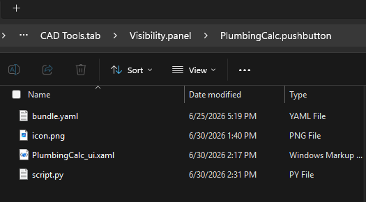
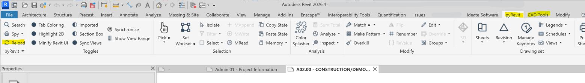

# pyRevit Plumbing Code Fixture Calculator

An interactive, modeless pyRevit extension designed to automate plumbing fixture calculations directly within Revit. This tool complies with the fractional method outlined in the **2025 Los Angeles Plumbing Code (LAPC)** and **2025 California Plumbing Code (CPC)** (Tables 422.1 & 4-1). 

It aggregates occupant loads by occupancy group per floor, tracks exact decimal fractions, dynamically generates a live math breakdown, handles all-gender aggregate restroom requirements, and pushes final integer counts to a custom parameterized annotation table for your code sheets.

---

## Features

* **2025 Code Compliant Engine**: Implements the latest thresholds, sex splits, step-functions, and divisors for all 21+ classifications in Table 422.1.
* **All-Gender Restroom Support**: Calculates the minimum aggregate counts by summing male and female fractions prior to a single final round-up, per 2025 CPC Section 422.1.1.
* **Level & Phase Filtering**: Isolates calculations to a selected floor and chronological phase, eliminating double-counting of rooms from older or demolished phases.
* **Bulk Parameter Editing**: Select multiple rooms in the dashboard UI to change their occupancy types, factor overrides, or exclusion status simultaneously.
* **Dynamic Width DataGrid**: Instant responsive UI rendering with rounded "pill" highlights for math metrics and automatic column sorting.
* **Live UI Sync & Safe Input Parsing**: Automatically updates mathematical outputs as you type by deferring calculations until cell modifications are committed.
* **Collapsible Math Breakdowns**: Displays real-time, bolded addition strings showing exactly how individual room values roll up to group totals.

---

## Installation & Setup Workflow

Please complete the following steps in order to get the plugin up and running.

1. [Step 1: Set Up the Shared Parameters File](#step-1-set-up-the-shared-parameters-file)
2. [Step 2: Establish the pyRevit Folder Directory](#step-2-establish-the-pyrevit-folder-directory)
3. [Step 3: Deploy the Extension Files](#step-3-deploy-the-extension-files)
4. [Step 4: Connect to pyRevit and Reload](#step-4-connect-to-pyrevit-and-reload)
5. [Step 5: Run Automated Parameter Binding](#step-5-run-automated-parameter-binding)
6. [Step 6: Build the Schedule Sheet Annotation Table](#step-6-build-the-schedule-sheet-annotation-table)

---

### Step 1: Set Up the Shared Parameters File

Revit requires specific Shared Parameters to handle data tracking for custom scripts. You can link your project to the prebuilt definition file provided in this repository.

#### Option A: Use the Prebuilt Shared Parameters File (Recommended)
1. In Revit, navigate to the **Manage** tab on the ribbon and click **Shared Parameters**.
2. Click **Browse** and point Revit directly to the included file at: 
   `[SHARED PARAMETERS FILEPATH]`
3. Click **OK** to cache the definitions.

#### Option B: Manual Entry into an Existing Shared Parameters File
If you need to merge these parameters manually into your firm's existing master file:
1. Open your master Shared Parameters `.txt` file in Notepad.
2. Add a new group identifier under the `*GROUP` block (ensure the Group ID number is sequential and unique):
   ```text
   GROUP	5	PlumbingCalc
   ```
3. Append the following database configuration schema block directly to the bottom of the `*PARAM` section:
   ```text
   PARAM	3b1a2c4d-5e6f-7a8b-9c0d-1e2f3a4b5c6d	Plumb_OccupancyType	TEXT	-	5	1	1
   PARAM	4c2b3d5e-6f7a-8b9c-0d1e-2f3a4b5c6d7e	Plumb_LoadFactor	NUMBER	-	5	1	1
   PARAM	5d3c4e6f-7a8b-9c0d-1e2f-3a4b5c6d7e8f	Plumb_SeatUnitCount	INTEGER	-	5	1	1
   PARAM	6e4d5f7a-8b9c-0d1e-2f3a-4b5c6d7e8f9a	Plumb_Exclude	YESNO	-	5	1	1
   PARAM	7f5e6a8b-9c0d-1e2f-3a4b-5c6d7e8f9a0b	Plumb_RoomOccupants	NUMBER	-	5	1	1
   ```
4. Save and close the file.

*Move on to [Step 2: Establish the pyRevit Folder Directory](#step-2-establish-the-pyrevit-folder-directory).*

---

### Step 2: Establish the pyRevit Folder Directory

pyRevit searches for a rigid folder naming hierarchy to generate tabs, panels, and ribbon buttons. Create the nested folder structure using one of the two options below depending on your Windows user permissions:

#### Option A: Local C: Drive Root (Requires Local Admin Privileges)
Use this option if you have full administrative rights to your machine:
```text
C:\pyRevit_CustomTools\
└── MyTools.extension\
    └── CAD Tools.tab\
        └── Visibility.panel\
```

#### Option B: User AppData Directory (No Admin Privileges Required)
If Windows permissions restrict root access to the C: drive, build the extension tree directly inside your local roaming profile directory:
```text
%APPDATA%\pyRevit\Extensions\
└── MyTools.extension\
    └── CAD Tools.tab\
        └── Visibility.panel\
```

*Move on to [Step 3: Deploy the Extension Files](#step-3-deploy-the-extension-files).*

---

### Step 3: Deploy the Extension Files

#### Option A: Copy Prebuilt Bundle Folder (Recommended)
1. Locate the prebuilt tool folder at: `[FILEPATH]`
2. Copy the entire `PlumbingCalc.pushbutton` folder.
3. Paste it directly inside the `Visibility.panel` directory you targeted in [Step 2](#step-2-establish-the-pyrevit-folder-directory).

#### Option B: Manual Source Deployment from GitHub
If downloading raw files from this repository:
1. Inside your `Visibility.panel` directory, create a new folder named exactly `PlumbingCalc.pushbutton`.
2. Place the following source files directly into it:
   * **`script.py`**: The Python calculation engine.
   * **`PlumbingCalc_ui.xaml`**: The WPF layout window.
   * **`icon.png`**: The ribbon user-interface button graphic.



*Move on to [Step 4: Connect to pyRevit and Reload](#step-4-connect-to-pyrevit-and-reload).*

---

### Step 4: Connect to pyRevit and Reload

1. Open Revit and navigate to the **pyRevit** tab on the ribbon.
2. Open the **pyRevit settings drop-down** (gear/hamburger menu icon) and click **Settings**.
3. Go to **Custom Extension Folders**, select **Add Folder**, and point it to your root path from Step 2 (either `C:\pyRevit_CustomTools\` or `%APPDATA%\pyRevit\Extensions\`).
4. Click **Save Settings and Reload**. The new ribbon button panel will generate on your screen.



*Move on to [Step 5: Run Automated Parameter Binding](#step-5-run-automated-parameter-binding).*

---

### Step 5: Run Automated Parameter Binding

There is no need to manually bind variables across your model elements. The tool includes an integrated "smart check" mechanism that configures its own database schema on its initialization loop.

1. Click your newly loaded **Plumbing Calc** button on the Revit ribbon.
2. The script will quietly scan your active project database in the background.
3. Finding the fields unlinked, it will automatically register and bind all 13 parameters to the native **Rooms** category (`OST_Rooms`).
4. Upon successful generation, a dialogue window will report that the setup succeeded and your dashboard will open instantly. On all future clicks, it will bypass this sequence seamlessly.

> **Fallback Note**: If corporate model permissions cause the automated binding routine to fail, please follow the manual override configuration steps detailed in the [Manual Parameter Binding Appendix](#manual-parameter-binding-appendix).

*Move on to [Step 6: Build the Schedule Sheet Annotation Table](#step-6-build-the-schedule-sheet-annotation-table).*

---

### Step 6: Build the Schedule Sheet Annotation Table

> ⚠️ **SYSTEM REQUIREMENT**: The accompanying grand total schedule annotation family requires **Autodesk Revit 2026 or newer** due to fundamental database architecture shifts within modern API data schemas.

To display the project grand totals dynamically on your code documentation sheets, you must leverage a single parameterized block family.

1. Open your project model, navigate to **Insert > Load Family**, and open the prebuilt family template located at:
   `[GENERIC ANNOTATION FILEPATH]`
2. Place an instance of this `Plumb_GrandTotals_Table` annotation family directly onto your targeted code sheet or drafting view.
3. Select the family instance, look at the Properties Palette, and locate the **GT_Level_Target** text field.
4. Type the exact case-sensitive name of the level you wish to report (e.g., `Level 1`). 


The calculator is now completely installed and configured!

---

## How To Use

1. Click the **Plumbing Calc** button on your ribbon panel to launch the modeless dashboard.
2. Use the top filters to isolate your target **Phase** and **Level**. The tool automatically identifies the newest chronological phase by default.
3. For each room line-item, assign its **Occupancy Type** using the alphabetized selector drop-down. The script instantly snaps to default load factors or provides a symbol indicator (`-`) if seat-count overrides apply.
4. If needed, select multiple rooms simultaneously and utilize the **Bulk Editor** pane to change types or check **Exclude Room** recursively.
5. Expand the **View Math Breakdown** panel at the base to evaluate the raw aggregated code math formatting.
6. Click **Calculate & Push Data to Revit**. This automatically writes parameter values to individual rooms, targets your schedule block instance via `GT_Level_Target`, and updates the sheet schedule integers instantly.


---

## Manual Parameter Binding Appendix

Use these instructions only if the automated parameter registration loop fails:
1. Go to the **Manage** tab on the ribbon and click **Project Parameters**.
2. Click **Add**, select **Shared Parameter**, and click **Select**.
3. Choose the `PlumbingCalc` group, pick your first parameter, and configure it as an **Instance** parameter.
4. Set **Group parameter under** to *Data* or *Plumbing*.
5. Check **Values can vary by group instance**.
6. In the right-hand Categories list, check **Rooms** and click **OK**.
7. Repeat this exact sequence for all parameters in the file.

[Back to Setup Workflow](#installation--setup-workflow)
